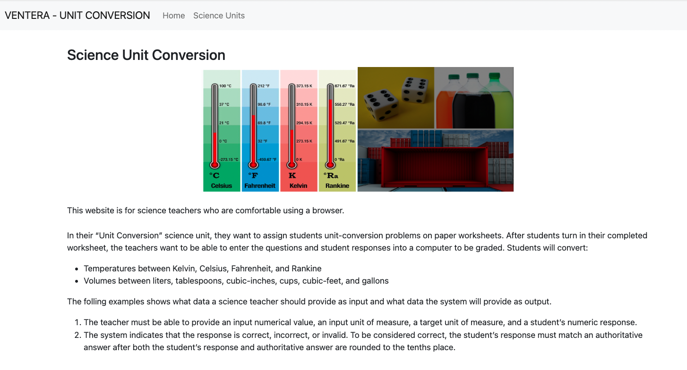
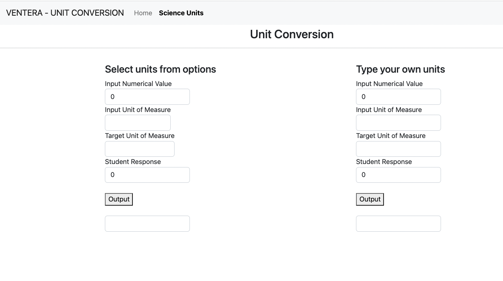

# Unit Conversion

#### Date: 02/04/2023

#### Due: 02/06/2023

#### By Jane M Wang
#### ventera-code.github.io

---

## _Description_

The project is trying to build a website for science teachers who are comfortable using a browser. In their “Unit Conversion” science unit,

they want to assign students unit-conversion problems on paper worksheets. After students turn in their completed worksheet, the teachers want

to be able to enter the questions and student responses into a computer to be graded.

The application will be implemented with Angular.

---

## _Technologies Used_

- Angular
- JavaScript
- Typescript
- HTML
- CSS/SCSS
- Visual Studio Code
- Github

---

## _How to install and run the website_

There are two ways to run the website.

1. in the browser, type "ventera-code.github.io" to run the website
2. fork the repo and run the website locally
   To run the website locally, you need do the following steps:
   - fork the repo (git clone ) on the terminal from https://github.com/ventera-code/ventera-code.github.io
   - after fork the repo, in the local repo, you need run "npm install" and "npm i bootstrap"
   - in angular.json, line 29, add "stlyes" of "node_modules/bootstrap/dist/css/bootstrap.min.css" to use bootstrap
   - then run "ng serve" on the terminal
   - finally run "localhost:4200" on the browser

Screenshots

